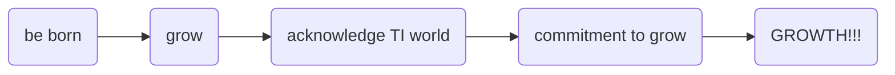

### Hi there 👋

🌱 My name is André and am currently learning Full-Stack Development. I love learning. I'm waiting for what the future brings us.

Below are my ranked languages:

| Rank | Languages |
|-----:|-----------|
|     1|   Python  |
|     2| JavaScript|
|     3|     C     |

⚡ Fun fact: When I was a kid I jumped off the swing and fell horibly and fractured my elbow

Until now, my journey depicts something like this...

AND I LOVE IT!!!

<!--
**ZALOFARG/ZALOFARG** is a ✨ _special_ ✨ repository because its `README.md` (this file) appears on your GitHub profile.

Here are some ideas to get you started:

- 🔭 I’m currently working on ...
- 🌱 I’m currently learning ...
- 👯 I’m looking to collaborate on ...
- 🤔 I’m looking for help with ...
- 💬 Ask me about ...
- 📫 How to reach me: ...
- 😄 Pronouns: ...
- ⚡ Fun fact: ...
-->
